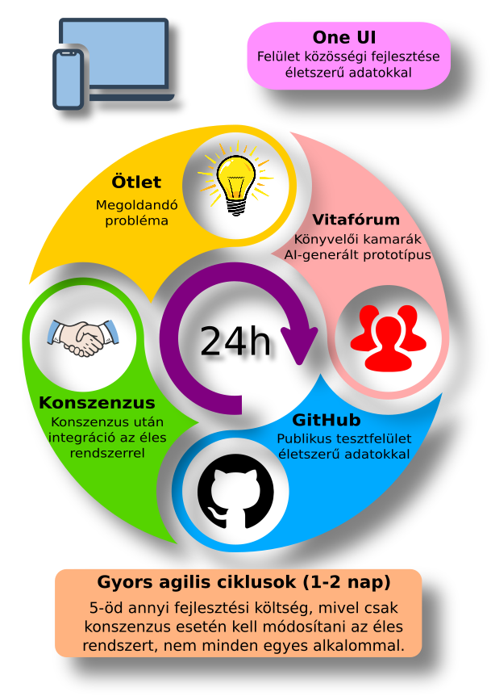

# E-közig

Az E-közig egy nyilvános felületi prototípus, amely a DÁP-menüszerkezetbe
illesztett NAV- és adóügyi ügyfélfolyamatokat mutat be. Többek között a
dokumentumkezelés, az időpontfoglalás, az adónaptár és a képviseleti
jogosultságok lehetséges működését szemlélteti.

A prototípus célja, hogy a felhasználók és a szakmai szereplők már a fejlesztés
korai szakaszában véleményezhessék a tervezett folyamatokat. Így a problémák a
háttérrendszerek kialakítása előtt felismerhetők és egyszerűbben javíthatók.

Az [élő prototípus](https://fssrepository.github.io/e-kozig/) kipróbálható, a
[forráskód](https://github.com/fssrepository/e-kozig/) pedig szabadon
áttekinthető. Észrevétel vagy hibajelzés a
[GitHub Issues](https://github.com/fssrepository/e-kozig/issues) felületén
rögzíthető.

