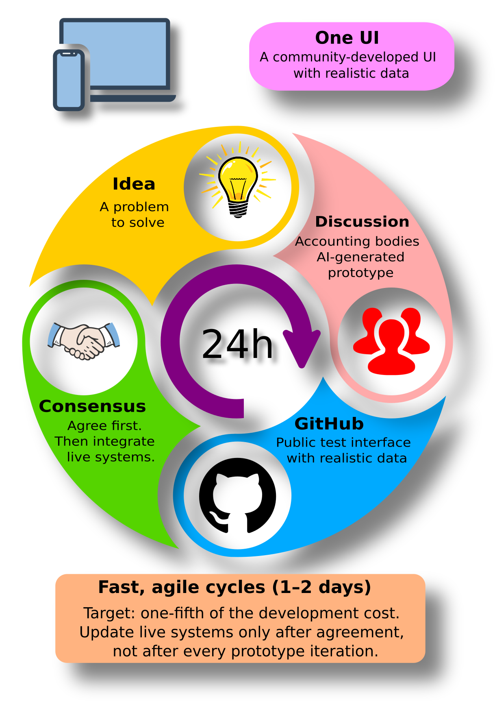

# E-Kozig

**A public UI prototype for Hungarian public administration and tax services.**

E-Kozig explores how documents, appointments, tax deadlines and delegated
access could work together in one service portal. It combines DÁP-style
digital government navigation with workflows inspired by Hungary's
National Tax and Customs Administration (NAV).

[Live prototype](https://fssrepository.github.io/e-kozig/) ·
[Project and AI usage](https://github.com/users/fssrepository/projects/4) ·
[Magyar bemutató](README.hu.md)

---

## Explore the prototype

**The live interface is currently in Hungarian.** This README and the process
diagram below provide an English introduction.

The prototype helps citizens, accountants and service designers review
proposed workflows before they are connected to live backend systems.

You can explore the design of:

- Document and invoice lists, search and filtering.
- Appointment booking and a tax calendar.
- Account selection and acting on behalf of another person or organisation.
- A visual form editor for administrative services.

---

## From an idea to a shared interface

  

1. **Identify a problem** in an existing administrative workflow.
2. **Discuss a prototype** with users and professional bodies.
3. **Test it publicly** with realistic example data and collect feedback.
4. **Reach agreement**, then integrate the agreed changes with live systems.

The timing and cost figures in the diagram are illustrative design targets.

---

## Feedback

[Open a GitHub issue](https://github.com/fssrepository/e-kozig/issues) with
the page or workflow you tried, what you expected, and what could be improved.
Feedback from both service users and domain specialists is welcome.

## Source and diagrams

- `src/` contains the Angular prototype; `docs/` contains the GitHub Pages build.
- English diagram: [PNG](guides/media/process-en.png) · [editable SVG](plans/process.en.svg).
- Original Hungarian diagram: [PNG](src/assets/img/process.png) · [editable SVG](plans/process.svg).
- [Restorable Project history and measurement notes](guides/project-history/README.md).

<!-- project-effort-summary -->

---

## Project effort and delivery

[View tasks and AI usage](https://github.com/users/fssrepository/projects/4) · [Restorable records and methodology](guides/project-history/README.md)

| Measure | This project |
| --- | ---: |
| Completed tasks | 16 |
| AI tokens, including cached input | 457.78 M |
| Allocated AI activity | 9.47 h |
| Standard API list-price equivalent | $260.28 USD |

These are retrospective estimates, combining recorded session usage with
labeled task allocations. Activity includes tool and network waits; it is not
human working time. The USD figure is an API-price comparison, not actual
spending or a subscription invoice. Each project has its own allocation;
shared work is split rather than counted in full more than once.
